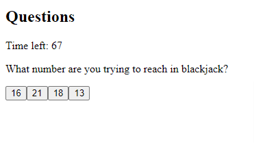
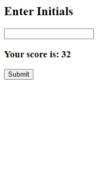

# Module 4- Quiz Homework

## Description:
- For this assignment we were told to make a quiz that cycles through the questions with the consequence of a wrong answer being time taken off of the timer. The other part of this assignment was whenever the quiz is over the user can put their information in a text box and submit it. The program was then supposed to store that information and keep track of the high scores.

## Visuals:

## Resources:
- [Resources](https://github.com/codytheroux96/quiz-homework-module-4)

- [Live Site](https://codytheroux96.github.io/quiz-homework-module-4/)